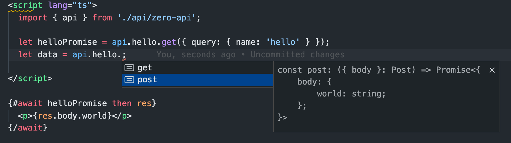

# svelte-zero-api

- [My broken english video](https://youtu.be/v2cYbPPfGNo)
  - This video is svelte-zero-api@0.1.26; Now svelte-zero-api@0.2.0 is very sample.

> Only 2kb size (not gzip)

Easy change [Svelte Kit](https://kit.svelte.dev/) APIs to `Zero API`.

Use [Svelte Kit](https://kit.svelte.dev/) APIs like call function, support Typescript.



## Install

```bash
npm install svelte-zero-api
```

## Getting started

### 1. Edit `svelte.config.js`, example:

```js
import preprocess from "svelte-preprocess";

// 1. import
import zeroApiWatch from "svelte-zero-api/watch";

// 2. add watch by change watchPath files, auto create api files:
if (process.env.NODE_ENV !== "production") {
  zeroApiWatch();
}

export default {
  preprocess: [preprocess({ postcss: true })],
  kit: { target: "#svelte" },
};
```

### 2. Use all api function in front-end pages, example:

at `src/routes/index.svelte`

```ts
<script lang="ts">
  import { zeroApi } from "../zeroApi";

  // We can use api before onMount, because api function only run in browser.
  // like front end function, and have Typescrit point out.
  let helloPost = zeroApi.api.hello.post({ body: { name: "Dog" } });
</script>

{#await helloPost}
	<div>loading...</div>
{:then res}
	<div>{res.body.world}</div>
{/await}

```

## API Example

at `src/routes/api/hello.ts`

```ts
import type { QueryGet } from "svelte-zero-api";

interface Get {
  query: {
    name: string;
  };
}

interface Post {
  body: {
    name: string;
  };
}

// Need return a Promise
// use `Get & QueryGet<Get>` definition types add query.get(...);
export const get = async ({ query }: Get & QueryGet<Get>) => {
  return { body: { world: "I'm a " + query.get("name") } };
};

// Need return a Promise
export const post = async ({ body }: Post) => {
  return { body: { world: "I'm a " + body.name } };
};
```

## Other

- [A simple Example](./example/README.md)
- [How about dont't use style-zero-api/watch?](./README-not-watch.md)

---

That's all, Thanks read my broken English.
