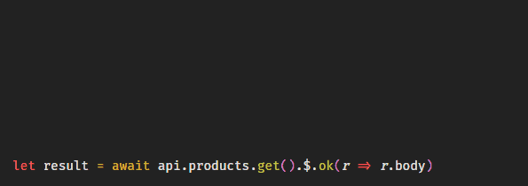
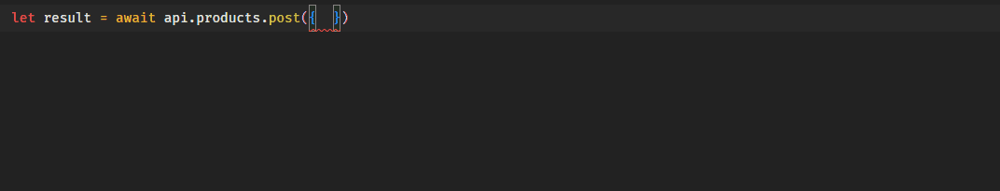

# NOTE
Currently being rewritten, and waiting for a TypeScript issue to be resolved.

Latest NPM package does not currently work with the SvelteKit August update. This upcomign update resolves bad performance (https://github.com/Refzlund/sveltekit-zero-api/issues/6), 
and makes it compatible with the recent SvelteKit changes. *Please await v0.11.0*.

# SvelteKit Zero API
Provides type-safety between front- and backend, but more importantly — creates a structure for ease of APIs in your project.

- Body and query is typed seemlessly in both frontend, and endpoints
- Queries are easier to use with querySpread which supports objects as query-params
- Endpoints are automatically gathered, so you don't have to remember them
- Returntypes of endpoints are available (in multiple ways) @ front-end
- Supports slugs
- Can be used in `Load`
- You can type-define variables with endpoint responses

This project is a fork of [svelte-zero-api](https://github.com/ymzuiku/svelte-zero-api) by [ymzuiku](https://github.com/ymzuiku).




### Sample project
If you want a **Sample Project**, go ahead and clone [sveltekit-zero-api-example](https://github.com/Refzlund/sveltekit-zero-api-example):

`git clone https://github.com/Refzlund/sveltekit-zero-api-example.git`

And run

`npm i`<br>
`npm run dev`

<br>

### Todo
- Export API documentation
- Allow using URLs for other domains, but including the functionality of ZeroAPI
- Allow types to coexist with tsconfig option: `strict: true`

<br>

### Requirements
- TypeScript in your SvelteKit project

<br><br>

## Install
1. Add to project: `npm i sveltekit-zero-api -D`
2. Add watchAPI at the top of `svelte.config.js`:
   ```ts
   import watchAPI from 'sveltekit-zero-api/watch'

   if (process.env.NODE_ENV !== 'production') {
      watchAPI()
   }
   ```
3. In `tsconfig.json` make sure to follow these configuration options: 
   ```ts
   { 
      compilerOptions: { 
         "strict": false,
         "lib": ["esnext", "DOM"],
         "module": "esnext",
         "target": "esnext"
       },
       "include": ["node_modules/sveltekit-zero-api/__temp.ts"]
   }
   ``` 
4. (optional) [Add aliases](./AddAliases.md) to make your life easier

<br>

### Configuration
#### **watchAPI**
| Property | Description | Default
| --- | --- | ---
| watchDir | The directory which will be watched for changes | `'src/routes'`
| outputDir | Where api.ts (to import) will be written | `'src'`
| apiName | The name of the output-file API config | `'api'`

> <br>The output-file will be imported in your front-end to access ZeroAPI <br><br>

<br><br>

#### **api.ts (default name) config**
Will be generated at `npm run dev` at ↑ outputDir

| Property | Description | Default
| -------- | ----------- | --------
| baseData | Data (body/query) which will be prepended to every request. Takes same inputs as the fetch function's 2nd param | `undefined`
| format | Default format for all responses | `'json'`
| baseUrl | Prepended to API url | `''`
| onError | Function to be called on error | `undefined`
| onSuccess | Function to be called on success | `undefined`
| stringifyQueryObjects | If a query value in a key-value pair is an object, it will be stringified automatically  | `true`
| prependCallbacks | Prepends callbacks. Ex.: `(method) => method.ServerError(errorHandler)` <sup>[tip](https://github.com/Refzlund/sveltekit-zero-api#error-handling-component)</sup> | `undefined`

<br><br><br><br>

## Getting Started

### Defining an endpoint

Endpoints are the URLs where we use our methods; GET, POST, PUT etc.

These *can* take a **body** or a **query**. Let's define our endpoint inputs:

```ts
interface Post {
   body: {
      productName: string
   },
   query?: {
      value?: number
   }
}
```

`query` and `query.value` are marked as optional using '?'. (Note: This is not validated by ZeroAPI)

We pass this interface, as our type to an endpoint:

```ts
import type { API } from './$types'
export const post = async (event: API<Post>) => {

} 
```

An endpoint (ex. **api.product.post**) always returns a response.
All generalized response-codes can be imported:

```ts
import type { API } from './$types'
import { Ok, BadRequest, InternalError } from 'sveltekit-zero-api/http'

interface Post {
   body: {
      productName: string
   },
   query?: {
      value?: number
   }
}

export const post = async (event: API<Post>) => {
   // You can include headers etc, as you would per a normal response - nothing new there
   let headers = new Header()
   // headers may be a key-value or whatever you like
   let headers = {}

   // We get our typed body:
   const { productName } = await event.request.json()

   // *sometimes I forget about the await statement. Since this is typed,
   // productName will show an error, if not awaited, since .json() returns a promise.

   /** ... some code to handle the endpoint */

   if(ok)
      return Ok({ body: { message: 'Product posted' }, headers })
   if(notOk)
      return BadRequest() // Default error message: Bad Request
   return InternalError({ error: 'Something went wrong.' })
} 
```

<br><br>

### Accessing endpoint in the front-end

**Note:** Run  `npm run dev`  to generate  `api.ts` 

On the front-end you can access your api by importing it, and it will have type-safety all the way.


#### **`api.ts`** - Accessing your endpoint
```ts
import api from '$src/api'
```
**api.ts** is a generated file by Zero API. It will include the type and functions for the whole operation.
If we have `src/routes/api/products.ts` as an endpoint with a POST, we can access it as `api.product.post`

<br><br>

#### **Request Parameters**
The api will automatically pick up the paramters for the endpoint.


<br><br>

#### **Awaited promise**
If you await an api function such as `api.products.get()`, you will get a [Response](https://developer.mozilla.org/en-US/docs/Web/API/Response) (unless you're using .$.).

```ts
let response = await api.products.get()
if(response.status == 200)
   console.log(response.body)

// eqv. to

api.products.get().ok(r => console.log(r.body))
```

<br><br>

#### **Slugs**
If you have a route like <br>
`src/routes/api/products/[warehouse]/storage/[product].ts`

You can access this by using
```ts
api.products.warehouse$('austin-warehouse').storage.product$(productId).get()
```


<br><br>

#### **[Load Function](https://kit.svelte.dev/docs/types#sveltejs-kit-loadinput)**
In SvelteKit, the load functions has its own fetch which you can pass to the api.
```html
<script context="module">
   export async function load({ params, fetch }) {
      const { id } = params

      // Pass `fetch` as the second argument
      const response = await api.products.id$(id).get({}, fetch)

      return {
         status: response.status,
         props: {
            product: response.ok && response.body
         }
      }
   }
</script>
```


<br><br>

#### **Callbacks**
For every response in your endpoint, there will be a callback function. If your backend returns 

```ts
return Ok({ body: { message: 'Hello there' } })
```
Then you can access it doing:
```ts
api.product.get().ok(response => { console.log(response.body.message) })
```

Every response-code has their own callback
```ts
Ok: 200            // .ok(response => )
BadRequest: 400    // .badRequest(response => ) 
InternalError: 500 // .internalError(response => )
```
And some callbacks cover more:
```ts
any: xxx           // .any(r => )
Informational: 1xx // .Informational(r => )
Success: 2xx       // .Success(r => )
redirection: 3xx   // .redirection(r => )
ClientError: 4xx   // .ClientError(r => )
ServerError: 5xx   // .ServerError(r => )
error: 4xx or 5xx  // .error(r => )
```

<br><br>

#### **The types in the backend are available in the frontend**
```ts
if(A)
   return Ok({ body: { message: 'Hello there', lol: false } })
else
   return Created({ body: { message: 'Message created', product: someProduct, lol: true } })

// Side-note: Any Error response (4xx/5xx), have { error: string, target: any }
// as optional options. They will be in response: { body: { error, target } }

// If error isn't populated, the error message will be it's name f.i. "error: 'Internal Error'"
return InternalError({ error: 'Something went wrong' })
```

Here you'll find the types:
```ts
api.product.GET()
   // { body: { message: string, lol: boolean }, ... }
   .Ok(response => {
      const {
         message, ✅
         product, ⛔
         lol ✅
      } = response.body
   }) 
   // { body: { message: string, product: ProductType, lol: boolean }, ... }
   .Created(({ body }) => {
      const { 
         message, ✅
         product, ✅
         lol ✅
      } = body
   }) 
   // { body: { error: string }, ... }
   .InternalError(r => console.error(r.body.error)) ✅
   .Success(r => {
      let body = r.body
      
      // All Success responses have { body: { message: string } }
      body.message ✅
      // Not all have product
      body.product ⛔

      if(!('product' in body)) // Return if 'product'-key is not in body
         return
      
      // Because we checked if product is in body, it is now valid
      body.product ✅
   })
```
These functions will also be called in order. So
1. Ok
2. Success

or

1. Created
2. Success

In case of 200 (Ok) or 201 (Created)

<br><br>

#### **._.**
If an endpoint does not return a status-code, but you still want a callback use **._.** wildcard:
```ts
api.product.GET()._.UnavailableForLegalReasons(handleError)
```

<br><br>

#### **.$.**
An **exception** to getting a `Promise<Response>`, is using the wildcard `.$.`

This returns whatever is returned from the trailing callback. Naturally, only one is allowed. And is only allowed in the end of the function.
If the return isn't an `Ok`, then it returns undefined.

```ts
// Since we don't »await«
// products: Product[] | undefined
let products = await api.product.GET().$.Ok(r => r.body)
if(!products) {
	console.error('Did not receive any products.')
	return
}
```


<br><br>

#### **Accessing types**
```ts
import type { ResponseBody, RequestParams } from 'sveltekit-zero-api'
```

ResponseBody gets the body of a response, for a specific status-code.
```ts
           // Where response: { body: { products: Product[] } }
let products: ResponseBody<typeof api.products.get, 200>['products']

let productParams: RequestParams<typeof api.products.post> = {
   body: { productName: 'Banana' },
   query: { value: 69.101 }
}
```

<br>
<br>

#### **querySpread**
The `querySpread` function helps you get and format your queries quickly:

```ts
import type { API } from './$types'
import { BadRequest, Ok } from 'sveltekit-zero-api/http'

/**
 * querySpread(searchParams, boolean = true)
 * boolean: true (default value) => format using determined schema below
 * boolean: false => no formatting, all will be plain (URL-decoded) strings
*/
import { querySpread } from 'sveltekit-zero-api'

interface Post {
   query?: {
      str: string,
      num: number,
      bo: boolean,
      obj: {
         something: string,
         array: any[]
      },
      arr: [],
      date: Date
   }
}

export const get = async (event: API<Post>) => {
   const { searchParams } = event.url
   
   const { str, num, bo, obj, arr, date } = querySpread(searchParams)

   // NOTE: ZeroAPI does NOT validate types!
   // It only attempts to format the values, based on the determination schema below

   if(typeof num !== 'number')
      return BadRequest({ error: 'num: Invalid format; must be a number' })

   obj.array.push('something')

   ...
}
```

Here's the formatting determination:
```ts
"abc"        => "abc"
"123.12"     => 123.12      // Only contains numbers
"$123.123"   => "$123.123"  // NaN
"123.12.12"  => "123.12.12" // NaN
"true"       => true
"TRUE"       => "TRUE"      // Booleans has to be lowercase
"false"      => false
"undefined"  => undefined
"null"       => null
"NULL"       => "NULL"      // `null` and `undefined` has to be lowercase
"{...}":     => {...}
"[...]"      => [...]
"2022-05-06T22:15:11.244Z"   => new Date("2022-05-06T22:15:11.244Z") // Only accepts ISO-date strings (i.e. `new Date().toISOString()`) 
'"2022-05-06T22:15:11.244Z"' => new Date("2022-05-06T22:15:11.244Z") // Has quotes around the ISO-string (from `new Date()`)
```
 
> <br>**Note:** Query objects will be stringified by [default](https://github.com/Refzlund/sveltekit-zero-api#apits-default-name-config):
> ```ts
> post({ query: { 
>    num: 123, 
>    obj: { message: 'Hi' }, 
>    arr: ['there']
> }})
> ```
> will be sent as
> ```ts
> post({ query: { 
>    num: 123, 
>    obj: JSON.stringify({ message: 'Hi' }), 
>    arr: JSON.stringify(['there'])
> }})
> ```
> Which is parsed into JSON again by [`querySpread`](https://github.com/Refzlund/sveltekit-zero-api/blob/master/lib/utility.ts#L74)
> <br><br>


<br>
<br>
<br>
<br>

## Tips

### Error Handling-component
If you have a component that sits on the root-layout and handles error messages by throwing a pop-up - then you can simply export a function from `context="module"`, which displays the error:
```ts
// src/lib/components/error-handler.svelte
<sript context="module">
   import { SvelteErrorResponse } from 'sveltekit-zero-api'
   
   export function handleError(response: SvelteErrorResponse) {
      errors = [...errors, response.body.error]
      setTimeout(shift, 2000)
   }

   const shift = () => { errors.shift(); errors = errors; }
   let errors: string[] = [] 
</script>

...
```
Somwhere else
```ts
import { handleError } from '$components/error-handler.svelte'

...

    products = api.products.post(params).error(handleError).$.ok(r => r.body)
```

<br><br>

### Passing the API around
Nothing prevents you from having a component ála

```ts
import { createEventDispatcher } from 'svelte'
const dispatch = createEventDispatcher()

export let api = undefined
let response

export function handleAPI() {
   response = await api()
      .ok(response => {
         Success = true
         dispatch('Success', response)
      })
      .error(response => {
         error = true
      })
}
```

```ts
import APIComponent from '...'
...

<APIComponent api={() => api.products.post(params)} let:Success let:response on:Success={...}>
   {#if Success}
      <div>
         Hi mom
      </div>
   {/if}
</APIComponent>
```
You can probably be more creative.

<br><br>

## Q&A
- The `api` type does not always update after changes
  - TypeScript can be a little late at picking changes up sometimes. The immediate fix is to,
   - make sure tsconfig.json has these configurations: 
        ```ts
      "compilerOptions": {
         "lib": ["esnext", "DOM"],
         "module": "esnext",
         "target": "esnext"
      },
      "include": ["node_modules/sveltekit-zero-api/__temp.ts"]
        ```
   - ctrl+click the "`api`" or "`seomthing`" part in `api.something.get` to open **__types.ts**, and TypeScript should pick up the changes
   - install VSCode Extension for [TS Nightly](https://marketplace.visualstudio.com/items?itemName=ms-vscode.vscode-typescript-next) for the TS beta
- Cannot read property '*' of undefined
  - Happens if you run the API on [SSR](https://kit.svelte.dev/docs#ssr-and-javascript). Use onMount, or any other client-side called functions (on:click etc.). Read more about component life-cycle: https://svelte.dev/tutorial/onmount

<br>
<br>

## Other

[Performance benchmarks](./PerformanceBenchmarks.md). There's no real noticable impact overall, but I wanted to include this anyways.
